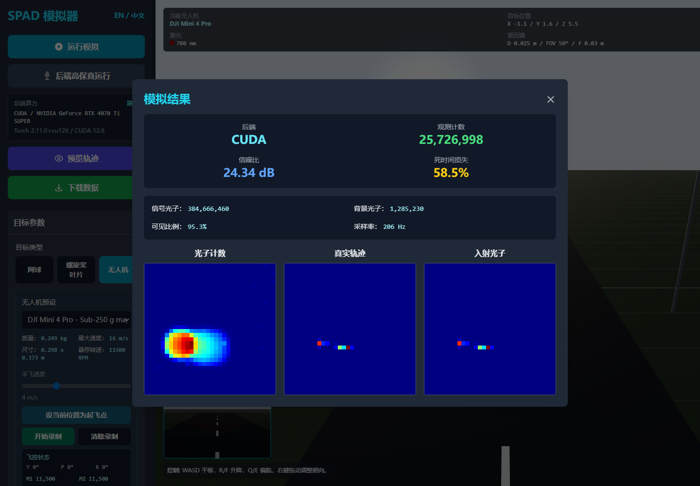
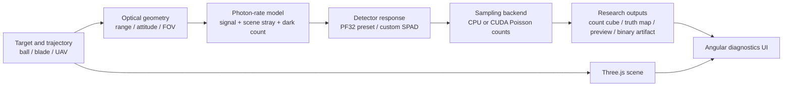

<div align="center">

# SPAD Detector

**A research-oriented single-photon active-imaging simulation platform for ball, propeller, and UAV scenes**

[](https://github.com/hansamar/spad-detector/actions/workflows/verify.yml)
[](LICENSE)


</div>

[**English**](README.md) | [**中文**](README_zh.md)

> **中文摘要**<br>
> SPAD Detector 是面向单光子主动成像研究的仿真平台。平台支持网球类球体、螺旋桨叶片和四旋翼无人机目标，提供 PF32 SPAD 阵列参数联动、太阳辐照度驱动的场景杂散光子、暗计数、死时间、视场裁剪、轨迹记录、CPU/CUDA 后端以及 Electron 桌面端。仓库包含可复现的验证脚本和 GitHub Actions 工作流。



## Research Scope

SPAD Detector is designed for researchers exploring active optical detection and photon-limited imaging of nearby dynamic targets. It combines an interactive Angular and Three.js scene with a FastAPI simulation backend and a Python physics core.

The platform currently models:

- spherical ball targets for tennis-ball-style motion studies;
- elongated propeller or blade targets, including custom uploaded silhouettes;
- quadrotor UAV targets with body geometry, four propellers, and DJI-based presets;
- fixed, waypoint-based, and manually recorded UAV trajectories;
- PF32 detector settings and user-defined detector overrides;
- laser-reflection signal photons, solar-reflection signal photons, solar-irradiance-dependent scene stray photons, and detector dark counts;
- frame-level and event-oriented SPAD output with CPU or CUDA Poisson sampling.

This repository focuses on nearby dynamic-target detection. Its ambient-noise model is expressed as scene stray photons and detector noise rather than space-debris background terms.

## Simulation Pipeline



## Platform Preview

The desktop interface exposes the selected compute backend, photon statistics, signal-to-noise ratio, dead-time loss, measured count map, truth trajectory, and incident-photon image in one workflow. The screenshot above was generated by the repository's browser smoke flow with the CUDA backend enabled.

## Key Capabilities

| Area | Current implementation |
| --- | --- |
| Target models | Spherical ball, blade strip, custom blade silhouette, quadrotor UAV |
| UAV presets | DJI Mini 4 Pro, DJI Mavic 3 Pro, DJI Inspire 3, DJI Matrice 350 RTK |
| Motion | Fixed pose, waypoint path, manual flight recording, attitude and propeller phase series |
| Detector | PF32 preset or custom SPAD settings |
| Noise | Scene stray photons scaled by current solar irradiance, plus separate detector dark counts |
| Optical effects | Independent transmitter divergence and receiver FOV, range, aperture, FOV clipping, atmospheric attenuation, reflectivity, dead time, saturation |
| Compute | CPU fallback and optional CUDA acceleration for batched photon-count sampling |
| Outputs | Lightweight summaries, full responses, asynchronous jobs, `.bin` count-cube downloads |
| Interfaces | Angular web UI, Three.js visualization, FastAPI backend, Electron desktop shell |

## Quick Start

### Prerequisites

- Node.js 22 LTS
- Python 3.12 or a compatible Python 3 environment
- Windows for the packaged Electron desktop workflow
- An NVIDIA GPU with a CUDA-enabled PyTorch environment for GPU acceleration

### Install

```powershell
git clone https://github.com/hansamar/spad-detector.git
cd spad-detector
npm install
python -m pip install -r requirements.txt
```

### Run the web workflow

Open two PowerShell terminals:

```powershell
# Terminal 1: FastAPI backend
npm run backend
```

```powershell
# Terminal 2: Angular frontend
npm run dev
```

Then open `http://127.0.0.1:3000`. The backend listens on `http://127.0.0.1:8000`.

### Run the desktop workflow

```powershell
npm run desktop:dev
```

The repository also provides Windows launchers:

- `启动项目.bat`
- `启动桌面仿真平台.bat`

## CUDA Backend

`npm run backend` probes available Python interpreters and prefers a CUDA-capable PyTorch environment. The desktop shell follows the same selection logic. On the original development workstation it first checks:

```text
~\.conda\envs\spad-detector\python.exe
```

You can explicitly select another environment:

```powershell
$env:SPAD_PYTHON_EXE = "C:\path\to\cuda-enabled\python.exe"
npm run backend
```

CPU fallback is available when explicitly requested:

```powershell
$env:SPAD_REQUIRE_CUDA = "0"
npm run backend
```

Probe the selected runtime with:

```powershell
node scripts/start-backend.cjs --probe
```

## Reproducibility Checks

Run the local verification set before publishing results or packaging the desktop app:

```powershell
npm run verify:backend
npm run verify:physics
npx tsc --noEmit --pretty false
npm run build
npm run verify:startup
python -m compileall -q backend sim scripts
```

`npm run verify:startup` is a local CUDA-environment check. GitHub Actions runs the portable CPU-compatible verification subset on every push and pull request.

## Backend API

| Endpoint | Purpose |
| --- | --- |
| `GET /api/capabilities` | Report Python, PyTorch, CUDA, GPU, and default worker information |
| `POST /api/simulate` | Return a full simulation response |
| `POST /api/simulate/summary` | Return a lightweight visualization summary |
| `POST /api/simulate/jobs` | Start an asynchronous simulation job |
| `GET /api/simulate/jobs/{job_id}` | Poll job state and summary |
| `GET /api/simulate/jobs/{job_id}/download` | Download the completed `uint16` count cube |

## Backend Limits

The backend rejects requests that exceed its guarded compute envelope:

| Limit | Value |
| --- | ---: |
| Frames per run | `200,000` |
| ROI pixels | `16,384` |
| Total frame-pixel samples | `204,800,000` |
| Recorded trajectory points | `50,000` |
| Custom-shape samples | `512` |

The frontend budget estimator uses the same frame and sample limits so oversized jobs are blocked before submission.

## Repository Layout

```text
src/        Angular UI, Three.js scene, frontend simulation services
backend/    FastAPI routes, job management, capability reporting, serializers
sim/        Python optical, detector, geometry, background, and sampling core
desktop/    Electron shell and CUDA-capable Python selection
scripts/    Physics, backend, CUDA-startup, and browser smoke checks
docs/       Stable documentation assets
```

Generated frontend output, local photon cubes, logs, caches, and Electron installers are excluded from source control. Rebuild Windows installer and portable artifacts locally with:

```powershell
npm run desktop:dist
```

## Research Notes

- The `pf32` detector preset combines public PF32 figures with documented engineering approximations for active-imaging studies.
- The default signal budget adds independent laser-reflection and solar-reflection terms. Scene stray photons remain an independent solar-driven detector-side term.
- Scene stray photons and dark counts remain separate terms throughout the simulation.
- CUDA accelerates the sampling path; researchers should still record the selected backend, dependency versions, random seed, and commit SHA when reporting results.
- Model assumptions and warnings are returned in backend simulation responses where applicable.
- Read the [physics model audit](docs/physics-model-audit.md) before using simulated photon counts as calibrated predictions.

## Citation

Until a DOI is published, cite the repository release, URL, and exact Git
commit used for an experiment:

```text
SPAD Detector: single-photon active-imaging simulation platform.
https://github.com/hansamar/spad-detector
```

## Open-Source Project Information

- Read [CONTRIBUTING.md](CONTRIBUTING.md) before opening an issue or pull
  request.
- See [ROADMAP.md](ROADMAP.md) for planned validation and reproducibility work.
- See [CHANGELOG.md](CHANGELOG.md) for release history.
- See [SECURITY.md](SECURITY.md) for responsible vulnerability reporting.

## License

SPAD Detector is available under the [MIT License](LICENSE).
