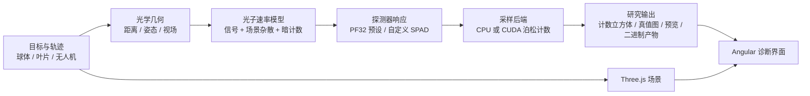

<div align="center">

# SPAD Detector

**面向球体、螺旋桨和无人机场景的单光子主动成像研究仿真平台**

[](https://github.com/hansamar/spad-detector/actions/workflows/verify.yml)
[](LICENSE)


</div>

[**English**](README.md) | [**中文**](README_zh.md)

SPAD Detector 是面向单光子主动成像研究的仿真平台。平台支持网球类球体、螺旋桨叶片和四旋翼无人机目标，提供 PF32 SPAD 阵列参数联动、太阳辐照度驱动的场景杂散光子、暗计数、死时间、视场裁剪、轨迹记录、CPU/CUDA 后端以及 Electron 桌面端。仓库包含可复现的验证脚本和 GitHub Actions 工作流。


## 研究范围

SPAD Detector 面向主动光学探测与近距动态目标光子受限成像的研究者设计。它将基于 Angular 与 Three.js 的交互式场景、FastAPI 仿真后端及 Python 物理核心整合为一体。

平台当前建模范围：

- 球形目标（用于网球式运动研究）；
- 细长螺旋桨/叶片目标，包括自定义上传的轮廓图形；
- 四旋翼无人机目标，包含机体几何结构、四个螺旋桨以及基于 DJI 机型的预设参数；
- 固定位姿、航点路径和手动记录的无人机轨迹；
- PF32 探测器设置与用户自定义探测器参数覆盖；
- 激光反射信号光子、太阳反射信号光子、与太阳辐照度相关的场景杂散光子，以及探测器暗计数；
- 基于 CPU 或 CUDA 泊松采样的帧级与事件型 SPAD 输出。

本仓库聚焦于近距动态目标探测。其环境噪声模型以场景杂散光子和探测器噪声表征，而非空间碎片背景项。

## 仿真流程



## 平台预览

桌面端界面在同一工作流中集中展示所选计算后端、光子统计、信噪比、死时间损失、实测计数图、真值轨迹以及入射光子图像。上图由仓库的浏览器冒烟流程在 CUDA 后端启用状态下生成。

## 核心能力

| 领域 | 当前实现 |
| --- | --- |
| 目标模型 | 球体、叶片条带、自定义叶片轮廓、四旋翼无人机 |
| 无人机预设 | DJI Mini 4 Pro、DJI Mavic 3 Pro、DJI Inspire 3、DJI Matrice 350 RTK |
| 运动模式 | 固定位姿、航点路径、手动飞行记录、姿态与螺旋桨相位序列 |
| 探测器 | PF32 预设或自定义 SPAD 设置 |
| 噪声 | 由当前太阳辐照度缩放的场景杂散光子，外加独立的探测器暗计数 |
| 光学效应 | 独立的发射器发散角与接收器视场、距离、孔径、视场裁剪、大气衰减、反射率、死时间、饱和 |
| 计算 | CPU 回退与可选 CUDA 加速（用于批量光子计数采样） |
| 输出 | 轻量摘要、完整响应、异步任务、`.bin` 计数立方体下载 |
| 界面 | Angular Web 界面、Three.js 可视化、FastAPI 后端、Electron 桌面端 |

## 快速开始

### 环境要求

- Node.js 22 LTS
- Python 3.12 或兼容的 Python 3 环境
- Windows（用于打包的 Electron 桌面端工作流）
- 配备 CUDA 环境的 NVIDIA GPU（用于 GPU 加速）

### 安装

```powershell
git clone https://github.com/hansamar/spad-detector.git
cd spad-detector
npm install
python -m pip install -r requirements.txt
```

### 运行 Web 工作流

打开两个 PowerShell 终端：

```powershell
# 终端 1：FastAPI 后端
npm run backend
```

```powershell
# 终端 2：Angular 前端
npm run dev
```

然后打开 `http://127.0.0.1:3000`。后端监听地址为 `http://127.0.0.1:8000`。

### 运行桌面端工作流

```powershell
npm run desktop:dev
```

仓库还提供了 Windows 启动脚本：

- `启动项目.bat`
- `启动桌面仿真平台.bat`

## CUDA 后端

`npm run backend` 会探测可用的 Python 解释器，优先选择支持 CUDA 的 PyTorch 环境。桌面端遵循相同的选择逻辑。在原始开发工作站上，它首先检查：

```text
~\.conda\envs\spad-detector\python.exe
```

你可以显式指定其他环境：

```powershell
$env:SPAD_PYTHON_EXE = "C:\path\to\cuda-enabled\python.exe"
npm run backend
```

如需显式使用 CPU 回退：

```powershell
$env:SPAD_REQUIRE_CUDA = "0"
npm run backend
```

使用以下命令探测所选运行时：

```powershell
node scripts/start-backend.cjs --probe
```

## 可复现性验证

在发布结果或打包桌面应用前，运行本地验证集：

```powershell
npm run verify:backend
npm run verify:physics
npx tsc --noEmit --pretty false
npm run build
npm run verify:startup
python -m compileall -q backend sim scripts
```

`npm run verify:startup` 为本地 CUDA 环境检查。GitHub Actions 在每次推送和拉取请求时运行可移植的 CPU 兼容验证子集。

## 后端 API

| 端点 | 用途 |
| --- | --- |
| `GET /api/capabilities` | 报告 Python、PyTorch、CUDA、GPU 及默认工作器信息 |
| `POST /api/simulate` | 返回完整仿真响应 |
| `POST /api/simulate/summary` | 返回轻量级可视化摘要 |
| `POST /api/simulate/jobs` | 启动异步仿真任务 |
| `GET /api/simulate/jobs/{job_id}` | 轮询任务状态与摘要 |
| `GET /api/simulate/jobs/{job_id}/download` | 下载已完成的 `uint16` 计数立方体 |

## 后端限制

后端会拒绝超出以下计算保护限制的请求：

| 限制项 | 值 |
| --- | ---: |
| 每次运行的帧数 | `200,000` |
| ROI 像素数 | `16,384` |
| 总帧-像素采样数 | `50,000,000` |
| 记录的轨迹点数 | `50,000` |
| 自定义形状采样数 | `512` |

前端预算估算器使用相同的帧数和采样数限制，因此超限任务在提交前即被阻止。

## 仓库结构

```text
src/        Angular 界面、Three.js 场景、前端仿真服务
backend/    FastAPI 路由、任务管理、能力报告、序列化器
sim/        Python 光学、探测器、几何、背景及采样核心
desktop/    Electron 外壳与 CUDA 兼容 Python 选择
scripts/    物理、后端、CUDA 启动及浏览器冒烟检查
docs/       稳定的文档资源
```

生成的前端输出、本地光子立方体、日志、缓存及 Electron 安装程序均被排除在版本控制之外。使用以下命令在本地重新构建 Windows 安装程序和便携版产物：

```powershell
npm run desktop:dist
```

## 研究注意事项

- `pf32` 探测器预设结合了公开的 PF32 数据与文档化的工程近似，适用于主动成像研究。
- 默认信号预算叠加了独立的激光反射项和太阳反射项。场景杂散光子为独立的太阳驱动探测器侧项。
- 场景杂散光子与暗计数在整个仿真过程中保持为独立项。
- CUDA 加速采样路径；研究者报告结果时仍应记录所选后端、依赖版本、随机种子及提交 SHA。
- 模型假设与警告在适用情况下会随仿真响应一并返回。
- 在将仿真光子计数用作标定预测之前，请阅读[物理模型审计](docs/physics-model-audit.md)。

## 引用

在 DOI 发布之前，请引用仓库发行版、URL 及实验所用的确切 Git 提交：

```text
SPAD Detector: single-photon active-imaging simulation platform.
https://github.com/hansamar/spad-detector
```

## 开源项目信息

- 在提交 Issue 或 Pull Request 之前，请阅读 [CONTRIBUTING.md](CONTRIBUTING.md)。
- 计划中的验证与可复现性工作详见 [ROADMAP.md](ROADMAP.md)。
- 发行历史详见 [CHANGELOG.md](CHANGELOG.md)。
- 负责任的漏洞报告详见 [SECURITY.md](SECURITY.md)。

## 许可证

SPAD Detector 基于 [MIT 许可证](LICENSE) 发布。
